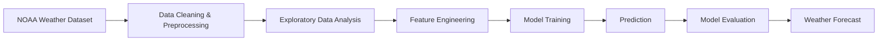

# Weather Forecasting Model

> **A machine learning project that analyzes historical weather data from NOAA to identify climate patterns and forecast weather conditions using predictive modeling techniques.**

Weather forecasting plays a vital role in industries ranging from agriculture and transportation to disaster management and environmental monitoring. This project leverages historical weather observations from the **National Oceanic and Atmospheric Administration (NOAA)** to explore weather trends and develop predictive models capable of forecasting future weather conditions.

The project follows a complete data science workflow, including data preprocessing, exploratory data analysis, feature engineering, model training, and performance evaluation.

---

## Features

- Historical weather data analysis
- Data cleaning and preprocessing
- Exploratory Data Analysis (EDA)
- Weather trend visualization
- Feature engineering
- Machine learning-based weather prediction
- Model performance evaluation

---

## Workflow



---

## Dataset

The project uses historical weather observations provided by the **National Oceanic and Atmospheric Administration (NOAA)**.

### Dataset Source

NOAA Climate Data Online (CDO)

https://www.ncdc.noaa.gov/cdo-web/search

The dataset contains meteorological observations collected from airports and weather stations, including temperature, precipitation, humidity, wind conditions, and other environmental measurements.

> **Note:** The dataset is not included in this repository due to its size.

### Downloading the Dataset

1. Visit the NOAA Climate Data Online portal.
2. Select the desired year(s).
3. Search for a nearby airport or weather station.
4. Add the station to your cart.
5. Choose **CSV** as the download format.
6. Select the required weather variables.
7. Submit your request with your email address.
8. Download the dataset from the email link provided by NOAA.
9. Place the CSV file in the project directory before running the notebook.

---

## Analysis Performed

The project includes:

- Data cleaning and preprocessing
- Missing value handling
- Historical weather trend analysis
- Exploratory data visualization
- Feature engineering
- Machine learning model training
- Prediction of future weather conditions
- Model performance evaluation

---

## Applications

- Weather forecasting
- Climate trend analysis
- Environmental monitoring
- Agricultural planning
- Disaster preparedness
- Data-driven decision making

---

## Technologies Used

| Category | Technologies |
|----------|--------------|
| Programming Language | Python |
| Data Processing | Pandas |
| Machine Learning | Scikit-learn |
| Model | Ridge Regression |
| Development | Jupyter Notebook |

---

## Installation

Clone the repository.

```bash
git clone https://github.com/BM-6337/Weather-Forecasting-Model.git

cd Weather-Forecasting-Model
```

Install the required dependencies.

```bash
pip install -r requirements.txt
```

---

## Running the Project

1. Download the dataset from NOAA.
2. Place the CSV file in the project directory.
3. Update the dataset path inside the notebook if necessary.
4. Launch Jupyter Notebook.

```bash
jupyter notebook "Weather Forecasting Model.ipynb"
```

Run all notebook cells sequentially to reproduce the analysis and forecasting results.

---

## Project Structure

```text
weather-forecasting-model/
├── Weather Forecasting Model.ipynb    # Complete analysis and forecasting pipeline
├── requirements.txt                   # Project dependencies
├── README.md                        
└── LICENSE
```

---

## Future Improvements

- Time-series forecasting using LSTM models
- Weather prediction with XGBoost and Random Forest
- Interactive weather dashboard
- Real-time weather forecasting API
- Hyperparameter optimization
- Multi-location forecasting

---

## License

This project is licensed under the MIT License.

---

> *Using historical weather data to build intelligent forecasting models through machine learning.*
